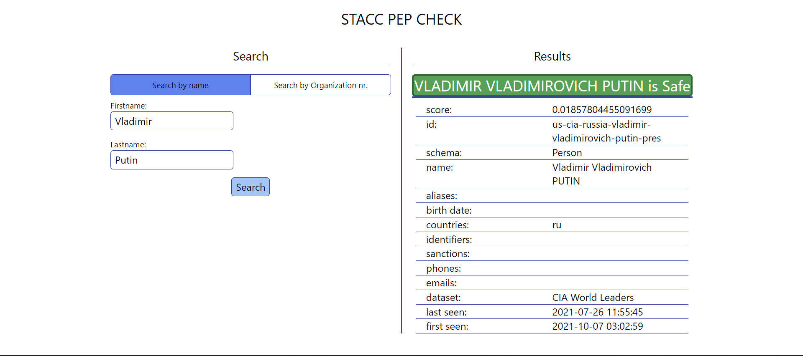
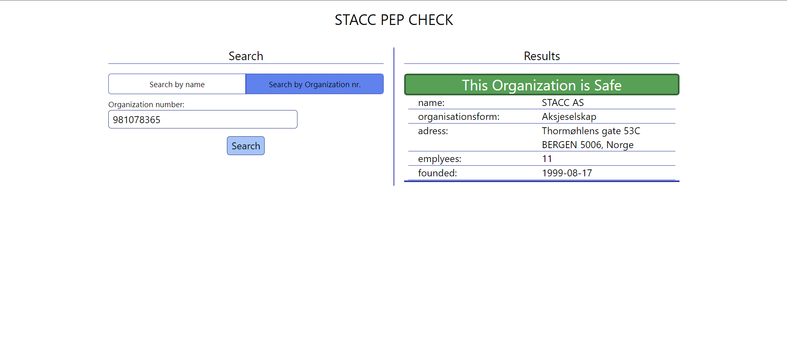
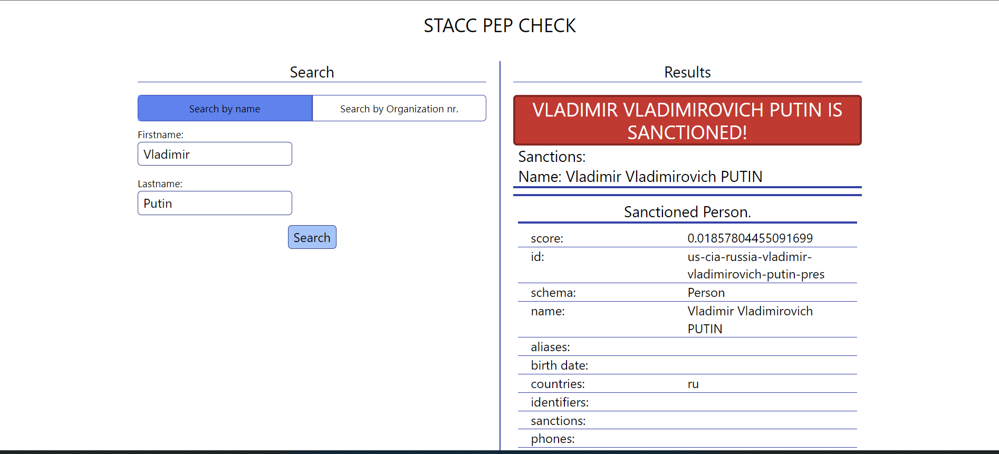
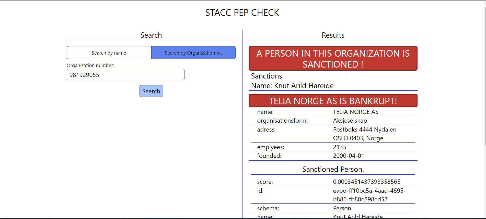

# Stacc code challenge 2021

## Description
> I chose to make a full-stack application consisting of an API that's searching for sanctions etc in your request, and an interactive front-end design that lets you verify the people and organizations that you're searching for. 

> My main focus was on the API, but I wanted to make a full stack application that lets you do the KYC screening of all the people the given API includes. 

> The API is created in nodejs using the express framework. 

> Front-end is created using the Vue.js framework combined with TailwindCSS. 

> I did not put much effort into the design, but by using TailwindCSS and Vue.js it was easy to make something that works. 

## How to run the project
1. Clone the repo.

2. Make sure to have nodejs installed:

        https://nodejs.org/en/

3. Run the following command:

    ````
    npm install
    ````

4. When all the dependencies are installed run this command to start the program:

    ````
    npm run start
    ````

5. Go to ````http://127.0.0.1:5050/````

## Description of the code
You'll find the code for the API in 
[app.js](./app.js)
The code is very much self explainatory, but there are comments to make it more readable. 

The API provides the possibility to search in the CSV file based on name, email, occupation, and date of birth, and a full KYC check of a PEP, based on the given API for this code competition. 

In the following folder
[/util](./util/)
you'll find my utility functions, that does all the work.

[./util/csvParser.js](./util/csvParser.js)
is my attempt to parse the pep.csv file into a readable JSON file.

[./util/scan.js](./util/scan.js)
does most of the work for scanning people and organizations for sanctions etc. 

[./util/sort.js](./util/sort.js)
consists of four functions to sort people from the CSV file. 

In the 
[./public](./public)
folder, you'll find the front-end code for the interactive form. 

[./public/home](./public/home)
Is the main landing page that lets you search  for people and orgs. 

[./public/search](./public/search/)
is where you can search in the CSV file based on name, email, occupation, and date of birth. 

## Previews
It was hard finding sanctioned people ect, but I made a few Screenshots of how it would look in different results.

### Safe person



### Safe organization



### Sanctioned Person


### Organization bankrupt and a person within the company is sanctioned



## Comments

> I found the pep.csv file hard to work with. It seems like some people have a few more empty slots than others, resulting in a twisted parsed file. For example, parsing the first 500 was no problem, but after that birthdays kept showing up where the name should be, etc. Ended up just using the API.

> As mentioned above I don't think the provided API is up to date because finding sanctioned people was harder than expected. 

* For example, I expected Putin to be    sanctioned, which he wasn't...

> As you can see in the example images if a person or organization is sanctioned or bankrupt you will be notified immediately. This is because this product is meant for banks to quickly do a screening of the given person and decide whether they're good for a loan or not.

> I also had to learn what KYC meant, and how it works. 

> I didn't spend too much time on the front-end to make the page responsive etc, I was more focused on making a full stack application  that works. 

> More detailed arguments for why I solved my problems how are documented as comments above or complementary to the code. 

> I downloaded the CDN version of Vue.js to make the job for frontend design a bit easier. 

> I also used TailwindCSS instead of just writing my own CSS to speed up the process of front end development. 